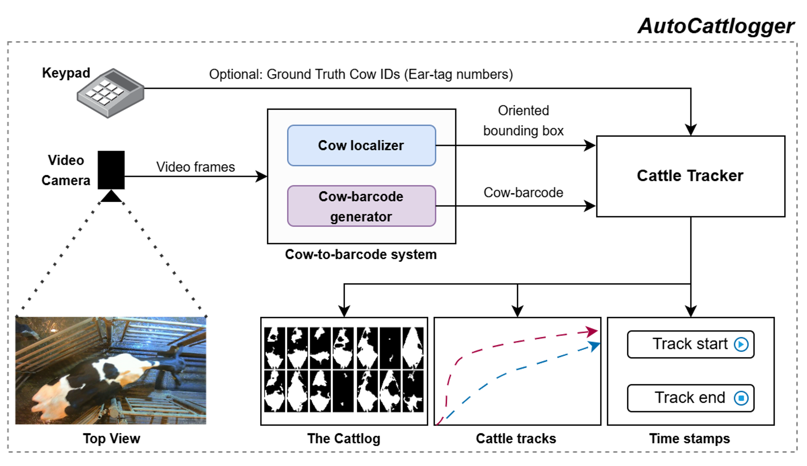

# AutoCattlogger & AutoCattleID

*Track assisted, automatic, cattle identity cataloger for recognition and beyond*

Author: Manu Ramesh 

Owner: Video Analytics for Daily Living (VADL) Laboratory, Elmore Family Schoool of Electrical and Computer Engineering, Purdue University, West Lafayette, IN

---

# About

This repository has code to run the AutoCattlogger, AutoCattleID, and some supplementary tools that could be useful for other cattle identification/analytics systems.


## Design philosophy: 
- Use stochastic, learning-based models for tasks which humans are innately good at. For example, to identify parts of a cow’s anatomy -- which look the same across all cows.
- Use deterministic, non-learning-based algorithms for tasks which computers are historically good at. For example, to memorize the appearances of hundreds of cows and finding the best match.
- Deep Learning/Deep Metric Learning methods identification systems must memorize or learn to cluster an impossibly large number of cow patterns for them to work without retraining , and that is not a practical solution.

## Highlights
- AutoCattlogger tracks cows under cameras and learns their identities as cow-barcodes.
- Barcode feature space allows direct and instant addition/deletion of cow identities.
- Barcode features make AutoCattlogger also good at one-shot learning.
- AutoCattlogger calibrates for scene lighting from reflections on fully black cows.
- Barcode based cattle recognition is robust to long-term changes in cow appearance.


This repository has code built on ideas presented in the following papers:
> - [Eidetic recognition of cattle using keypoint alignment](https://library.imaging.org/ei/articles/35/7/IMAGE-279): Introduced barcode based cattle identification (the cows themselves are converted to barcodes, we do not stick barcodes on cows), keypoints for pose correction, and keypoint interpolation.
> - [SURABHI: Self-Training Using Rectified Annotations-Based Hard Instances for Eidetic Cattle Recognition](https://www.mdpi.com/1424-8220/24/23/7680): Introduced error-detection and error-correction algorithms to handle keypoint-detection errors.
> - [Black-mirror light-probe cow model for specular highlight removal to improve Holstein cattle identification](): Introduced scene-illumination modeling using fully black cows for color-correction. Color-correction improves the quality of the generated barcodes.
> - [AutoCattlogger: Track-assisted, automatic, instant cattle identity cataloger for recognition and beyond](https://www.sciencedirect.com/science/article/pii/S2772375525007920): Introduced tracking of individual cows, and selective picking of instances to create the averaged barcode. This automated the whole procedure.


**The AutoCattlogger can be used to aid your research in several ways. Example use cases are mentioned below.**
- To track individual cattle in the top-view. The tracks information that the AutoCattlogger outputs can be used to estimate how much the cow has walked, whether the cow visited a particular spot or not, etc.
- To extract the rotated, cropped and masked images of cow instances for building a dataset to train your own cattle identification methods.
- To record the time interval in which specific cows are present in order to generate clips of the same cow in synchronized camera feeds in other views.
- To identify individual cattle.

# Quick start




- Complete setting up the environment by following the instructions in the [setup readme file](./setup/readme.md).
- Download our pretrained model weights by following the downloading instructions in the [models readme file](./models/readme.md).
- Training: Generate the cattlogs from at least two sets of videos (for training and eval):
    ```
    python generateCattlogs.py -c ./configs/autoCattlogger_configs/autoCattlogger_example_config.yaml -s ./data/sampleVideos1/ -g ./data/annotations/annotations1.csv -o ./outputs/ac_outputs_1/

    python generateCattlogs.py -c ./configs/autoCattlogger_configs/autoCattlogger_example_config.yaml -s ./data/sampleVideos2/ -g ./data/annotations/annotations2.csv -o ./outputs/ac_outputs_2/
    ```
    - Use the help flag to list all available options.
        ```
        python generateCattlogs.py --help
        ```
    - Supply your own config file with the required entries if you want to change the model weights.
        - We recommend that you train the keypoint and mask detectors on a few samples of your own data for it to function well. You could leverage our annotated data by appending your samples to our dataset and training the models on this extended dataset. More info on this is provided **here**.
    - The annotations CSV file supplied using the -g option should have a column with a header 'CowID', with each row of the column containing the ID of the cow in order in which they appear in the videos.
         - The cattlogs get generated even without this option. But this is needed for the recognition system to work -- so that it can associate a trackID with a real-world CowID.
- Evaluation: Evaluate AutoCattleID (ACID) using the tracks from the two sets of videos. You can also use the training set's cattlog if you have it already.
    ```
    python evaluateAutoCattleID.py -t ./outputs/temp/tracks_withGTLabels.pkl -e ./outputs/temp/tracks_withGTLabels.pkl -o ./outputs/ACID_outputs/ -l '_trial'
    ```
    - Use the help flag to list all available options.
        ```
        python evaluateAutoCattleID.py --help
        ```
    - Use the -c flag to supply the cattlog if you have it ready. Otherwise, you can choose to generate one from the tracks file using the -t flag. The -t option is useful for generating better quality barcodes as it can be coupled with available filters (Can be selected with --trackPtsFilterFnName flag). 
        - You can choose to filter the training tracks or evaluation tracks independently. Learn about this by going through the list of options in the help menu.
        - The AutoCattlogger paper filters only the training day tracks to select the best trackPoints (cow instance) to generate good quality barcodes.

- Inference: Use the cattlog (can be created from tracks) from a set of videos to infer cow-identity. 
    - You can run inference on sigle image/frame, single video, or a directory with top-view videos.
        - Running inference on a single image. Example:
            ```
            python inferID.py -C ./configs/autoCattlogger_configs/autoCattlogger_example_config.yaml --cattlogDirPath ./outputs/temp/autoCattlogV2_sampleCrops_withGTLabels/ -t ./outputs/temp/tracks_withGTLabels.pkl --filterFnName trackPtsFilter_byProximityOfRBboxToFrameCenter -o ./outputs/ACID_inference_outputs/ frame -i ./data/sampleImages/sample1.png -d
            ```
        - Running inference on a video. Example:
            ```
            python inferID.py -C ./configs/autoCattlogger_configs/autoCattlogger_example_config.yaml --cattlogDirPath ./outputs/temp/autoCattlogV2_sampleCrops_withGTLabels/ -t ./outputs/temp/tracks_withGTLabels.pkl --filterFnName trackPtsFilter_byProximityOfRBboxToFrameCenter -o ./outputs/ACID_inference_outputs/ video -i ./data/sampleCutVideos/cam24_2022-06-08_05-29-20_6131_76219_76700.avi -F 1
            ```
        - Running inference on a directory of (top-view) videos. Example:
            ```
            python inferID.py -C ./configs/autoCattlogger_configs/autoCattlogger_example_config.yaml --cattlogDirPath ./outputs/temp/autoCattlogV2_sampleCrops_withGTLabels/ -t ./outputs/temp/tracks_withGTLabels.pkl --filterFnName trackPtsFilter_byProximityOfRBboxToFrameCenter -o ./outputs/ACID_inference_outputs/ videoDir -i ./data/sampleCutVideos/ -F 1
            ```
            - You can also make this save cattlog outputs while running inference using the --functionAsAutoCattlogger flag. This can be useful if you are looking to clean up ground truth annotations while adding new cows to your database (cattlog).
    - To get a list of options, use the --help flag.
        ```
        python inferID.py --help
        python inferID.py frame --help
        python inferID.py video --help
        python inferID.py videoDir --help
        ```     


# Other information

## Color-correction (BMLP)
Specular highlights on cows tend to deteriorate the quality of the generated barcodes. You can follow the instructions in [readme file of the bmlp (black-mirror light-probes) directory](./autoCattlogger/bmlp/readme.md) to model the scene illumination from reflections on a black cow, and to use the generated illumination map to color-correct other cows in the scene.

## FAQs
For FAQs, refer the [FAQs file](./docs/FAQs.md).
For instructions on cattlogging and identifying cows on custom data read [this file](./docs/Cattlog%20on%20Custom%20Data.md).
For more information refer the [docs](./docs/) folder. 

## Tools

For a list of tools to help you edit cattlogs, generate cropped cow images for training cattle detectors/identifiers, or match cows to tracks, refer the [tools readme file](./autoCattlogger/tools/readme.md).
You can use these to support your own research in other areas as well.

# Citation
Please cite the paper below if you use the repo or any part of it. The bib information is provided below.

> @article{RAMESH2025101561,
title = {AutoCattlogger: Track-assisted, automatic, instant cattle identity cataloger for recognition and beyond},
journal = {Smart Agricultural Technology},
volume = {12},
pages = {101561},
year = {2025},
issn = {2772-3755},
doi = {https://doi.org/10.1016/j.atech.2025.101561},
url = {https://www.sciencedirect.com/science/article/pii/S2772375525007920},
author = {Manu Ramesh and Amy R. Reibman},
keywords = {Cattle recognition, Cattle tracking, Cattle identification, Video analytics}

Other publications from our lab can be found here: [https://engineering.purdue.edu/VADL](https://engineering.purdue.edu/VADL)

### Other details
- The data used for this research was collected under IACUC 1803001704.


